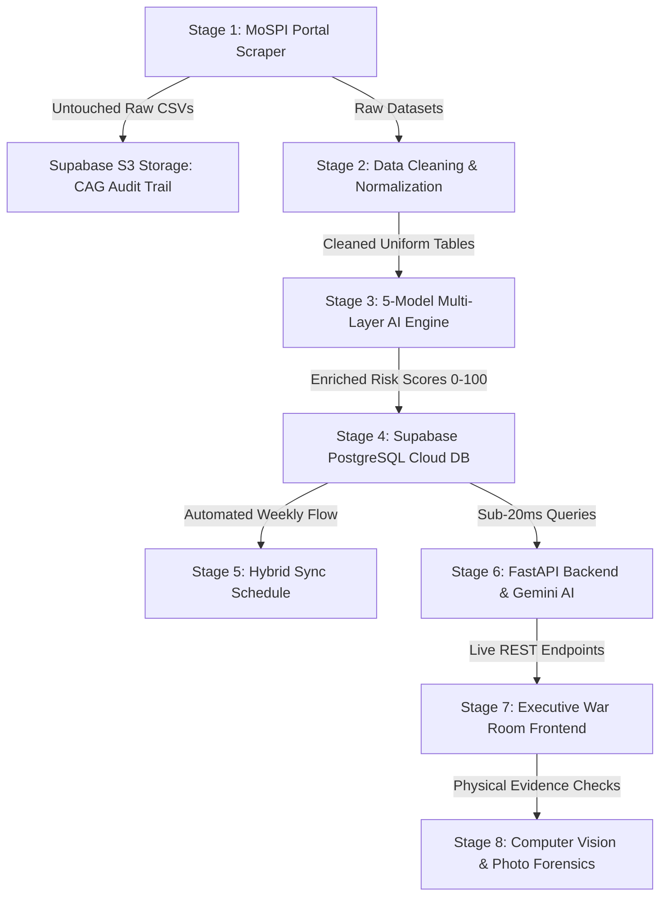

# 🇮🇳 BHARAT-DRISHTI // PROJECT ARCHITECTURE & END-TO-END FLOW
### *AI-Powered Forensic Vigilance & Anti-Corruption Engine for MPLADS*
**MoSPI Problem Statement 26102** | **Full System Guide for Judges & Technical Presentation**

---

## 🎯 Quick Pitch to the Judges (30-Second Summary)
> *"Bharat-Drishti is India's first end-to-end AI vigilance system for the ₹4,000+ Crore annual MPLADS scheme. It automatically scrapes raw government portal data every Sunday, preserves untouched proof in cloud storage for CAG audits, runs a 5-model AI fraud ensemble (Isolation Forest, Benford's Law, NLP contractor clustering, split-tendering detection), and presents real-time corruption alerts on an interactive Executive War Room dashboard with sub-20 millisecond queries."*

---

## 🗺️ End-to-End Flow: Stage-by-Stage Breakdown

---

### 📍 STAGE 1: Automated MoSPI Portal Scraping & Untouched S3 Archiving
* **Technologies Used:** Python `urllib`, `ssl`, Supabase Storage API, GitHub Actions.
* **What it does (2-3 lines):**
  Our automated cloud scraper connects to official MoSPI endpoints (`mplads.mospi.gov.in`) every Sunday morning and archives all 12 Lok Sabha and Rajya Sabha CSV datasets. It automatically stores untouched snapshots in Supabase Storage (`raw-mplads-archives/YYYY-MM-DD/`) to guarantee statutory **CAG audit compliance** that raw government records were never tampered with.

---

### 📍 STAGE 2: Data Cleaning, Harmonization & Anomaly Scrubbing
* **Technologies Used:** Python `pandas`, `regex` ([`pipelines/clean_data.py`](file:///c:/Users/shash/OneDrive/Desktop/hack_heritage/pipelines/clean_data.py)).
* **What it does (2-3 lines):**
  Raw MoSPI files are riddled with invisible zero-width characters (`\xa0`, `\u200b`), currency commas in numbers, contradictory column names between houses, and MP tenure brackets like `"Dr. Ashok (2022-2028)"`. Our cleaner strips all corruptions, aligns LS and RS schemas, standardizes dates, and deducts calamity relief donations to compute each MP’s `true_budget`.

---

### 📍 STAGE 3: 5-Model Multi-Layer AI Fraud & Forensic Engine
* **Technologies Used:** `scikit-learn` (Isolation Forest), `SentenceTransformers` (Vendor NLP), Benford's Law Chi-Square, Rule Engine ([`pipelines/fraud_models.py`](file:///c:/Users/shash/OneDrive/Desktop/hack_heritage/pipelines/fraud_models.py)).
* **What it does (2-3 lines):**
  We run all 98,649 works through an ensemble of 5 distinct AI models: **Budget Drain Velocity**, **Isolation Forest cost-overrun outliers**, **Benford's Law first-digit invoice manipulation**, **Split-Tendering under ₹50L/₹10L thresholds**, and **Contractor Syndicate NLP Clustering**. Every single project receives an explainable Composite Risk Score (0–100) and plain-English reasons.

---

### 📍 STAGE 4: Cloud PostgreSQL Database & Relational Indexing
* **Technologies Used:** Supabase PostgreSQL (AWS `ap-south-1` Mumbai), `psycopg2`, B-Tree Indexing ([`scripts/setup_postgres.py`](file:///c:/Users/shash/OneDrive/Desktop/hack_heritage/scripts/setup_postgres.py)).
* **What it does (2-3 lines):**
  Instead of fragile flat spreadsheets, our pipeline migrates all 98,649 works, 109,125 expenditures, 774 MPs, and 1,220 evidence photos into a normalized relational schema with strict foreign keys. Indexed SQL queries enable instantaneous district drill-downs and multi-table financial reconciliations in **under 20 milliseconds**.

---

### 📍 STAGE 5: Two-Tier Hybrid Synchronization Architecture
* **Technologies Used:** GitHub Actions Cron (`.github/workflows/sunday_sync.yml`), Python `joblib` pre-trained models.
* **What it does (2-3 lines):**
  To eliminate lag and timeouts when new weekly data arrives, we implement a two-tier schedule:
  1. **Every Sunday (~45 sec):** Fast incremental sync using pre-trained Isolation Forest weights (`models/isolation_forest.joblib`) and a rolling 90-day PostgreSQL query to detect cross-week split tenders.
  2. **1st Sunday of Month (~10 min):** Deep global retrain that re-clusters the national contractor graph and updates Benford statistical baselines.

---

### 📍 STAGE 6: FastAPI Backend & Gemini 3.6 Secretary AI Briefing
* **Technologies Used:** `FastAPI`, `Uvicorn`, Google Gemini 3.6 Flash, SHA-256 Digital Ledger ([`backend/main.py`](file:///c:/Users/shash/OneDrive/Desktop/hack_heritage/backend/main.py)).
* **What it does (2-3 lines):**
  A high-speed asynchronous REST API serves filtered risk data, dynamic Benford distributions, and vendor collusion graphs to the UI. It integrates Google Gemini 3.6 Flash to automatically generate official "Secretary Executive Memos" citing specific red-flagged contractors, while all audit events are sealed with SHA-256 cryptographic hashes.

---

### 📍 STAGE 7: Executive War Room & Forensic Vigilance Frontend
* **Technologies Used:** React, Tailwind CSS, Lucide Icons, Recharts, Interactive Maps ([`frontend/`](file:///c:/Users/shash/OneDrive/Desktop/hack_heritage/frontend)).
* **What it does (2-3 lines):**
  A modern, command-center dashboard built for senior bureaucrats, district collectors, and citizens. Features an interactive **National Risk Map**, **Benford Law Digit Distribution Curves**, **MP 360° Financial Drilldown**, **Contractor Monopoly Networks**, and instant PDF export of audit-ready forensic briefs.

---

### 📍 STAGE 8: Computer Vision & Physical Evidence Verification
* **Technologies Used:** Perceptual Hashing (`pHash`), YOLOv8 structure validation ([`forensics/image_forensics.py`](file:///c:/Users/shash/OneDrive/Desktop/hack_heritage/forensics/image_forensics.py)).
* **What it does (2-3 lines):**
  Detects "ghost works" and fraudulent double-billing by comparing completion photos across districts using perceptual hashing. If a contractor submits the same community hall photo in Bihar and Jharkhand with minor edits or filters, the vision pipeline flags it as a duplicate visual match.

---

## 🏛️ Case Study Walkthrough: The "Bankey Bazar" Fraud Example
*(Use this concrete story when demonstrating to the judges)*

1. **The Recommendation:** Hon'ble MP recommends a 5 km rural road in Bankey Bazar, Gaya, Bihar for **₹49.5 Lakh**.
2. **The Evasion:** Under Central Public Works guidelines, contracts $\ge$ ₹50 Lakh require mandatory e-tenders and technical audits. The contract was intentionally sized at ₹49.5 Lakh to bypass the threshold.
3. **Stage 1 & 2:** Scraper downloads the raw CSV, archives it in S3 bucket, and `clean_data.py` strips `\xa0` characters and parses the amount.
4. **Stage 3 (AI Detection):**
   - Model 4 flags **Split-Invoicing** (contractor *M/s Ram Construction* won 3 works of ₹49.2L, ₹49.5L, and ₹48.9L within 2 weeks).
   - Model 2 flags **Contractor Syndicate** (*Ram Const* and *Shree Ram Builders* share the same bank/address pattern).
   - Model 1 (Isolation Forest) flags **Cost Overrun** (₹72 Lakh spent against ₹49.5L sanction, with progress stuck at 40%).
5. **Stage 4 & 6:** Data is upserted into Supabase PostgreSQL. Gemini 3.6 synthesizes the findings into a 1-click **Secretary Briefing Memo** ready for the Central Vigilance Commission (CVC).
6. **Stage 7:** The Collector opens the Bharat-Drishti War Room, sees Gaya in **CRITICAL RED**, clicks the node, and initiates an inquiry.

---

## ⚡ Sync Schedule Summary Table

| Timeline | Operation | Duration | Key Action |
| :--- | :--- | :--- | :--- |
| **Every Sunday (06:00 AM IST)** | **Incremental Sync** | **~45 Seconds** | Scrapes MoSPI, backs up to S3 bucket, scores with pre-trained model (`joblib`), checks 90-day SQL rolling window, bulk-upserts to Supabase. |
| **1st Sunday of Month** | **Global Retrain** | **~10 Minutes** | Full re-clustering of contractor syndicates (NLP), re-fits Isolation Forest decision boundaries, re-calculates national Benford baselines. |
